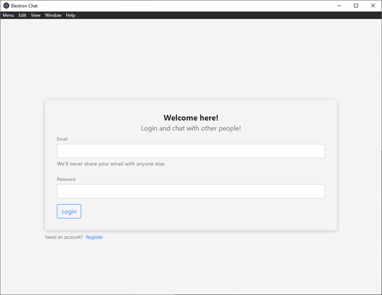
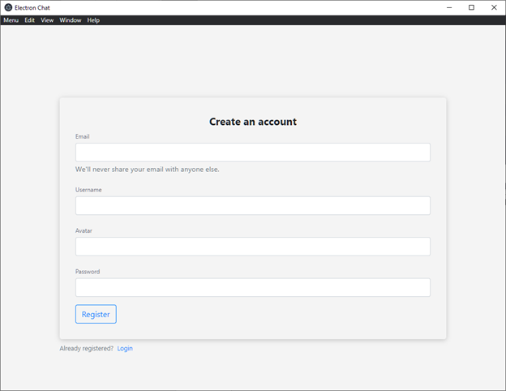
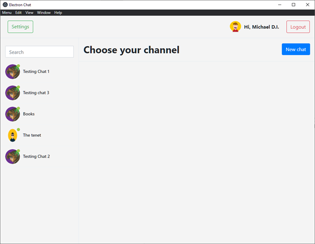
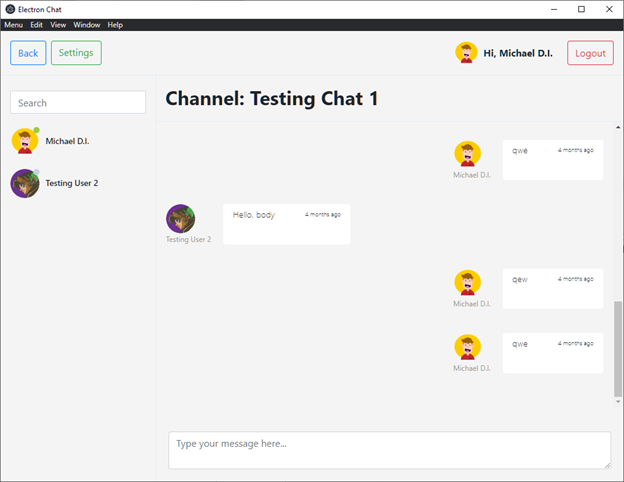
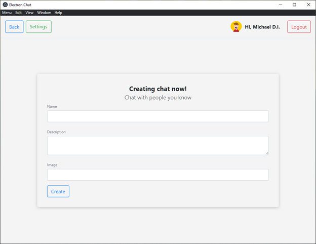
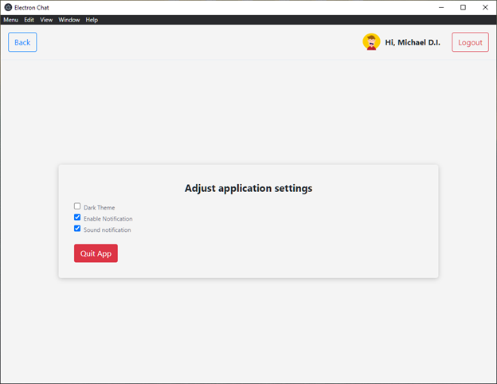
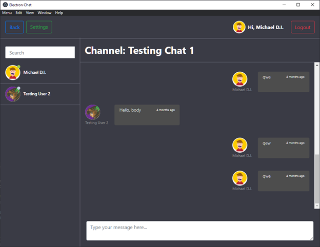

# Chat-App
Electron app React Redux 

Use 'npm install' to install project dependencies.

Use 'npm start' to start development.

Use 'make:macos' / 'npm make:win' / 'make:linux'  to build the app on the appropriate OS.

Finished application screenshots:

Login:

Registration:

Chat list:

Chat:

Chat creating:

Settings:

Dark theme:

